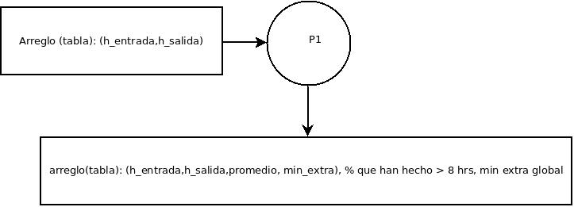
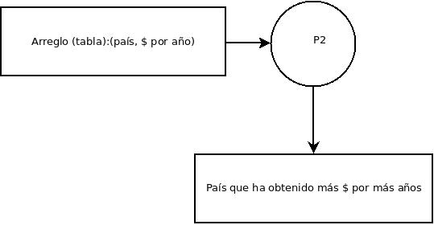

# PROBLEMA 1

Supongamos que  una empresa tiene 480 trabajadores que registran ("checan") su  entrada y salida  de la empresa. Cada registro de checada contiene la hora en minutos absolutos, es decir, desde las 00:00 -- si un trabajador checa entrada a las `08:10` y checa salida a las `16:30`, el registro de ese empleado indicará  `490 minutos` al entrar y `990 minutos al salir`. Al final de la jornada se tiene una secuencia de pares que indica a qué hora ha llegado y a qué hora se ha ido cada trabajador.  Los dos últimos datos de la secuencia que se capturan son dos ceros: `0 0`. Se quiere saber el porcentaje que han hecho como mínimo `8 horas = 480 minutos` y la cantidad de minutos extra que se han hecho.  

El programa tiene que ir leyendo los pares (variables enteras de entrada y salida) y calcular el tiempo trabajado por cada empleado. Entonces hay que contabilizar si el trabajador ha hecho como mínimo `480 minutos` o no. Al  mismo tiempo, si el empleado ha trabajado más de 8 horas hay que contar el exceso de minutos.
## Diagramas
### Flujo de datos

 
# PROBLEMA 2

Una compañía de componentes electrónicos tiene los datos de las ganancias obtenidas en dos países distintos durante los últimos `N años`. Los datos son pares reales. Se quiere saber qué país ha obtenido mayor ganancia durante más años.  

# Notas
1. Realizar un menú (switch-case) para los dos problemas y el menú se debe de repetir hasta que se pulse la opción salir.  
2. Cada problema debe de ser desarrollado en un módulo o función.  

